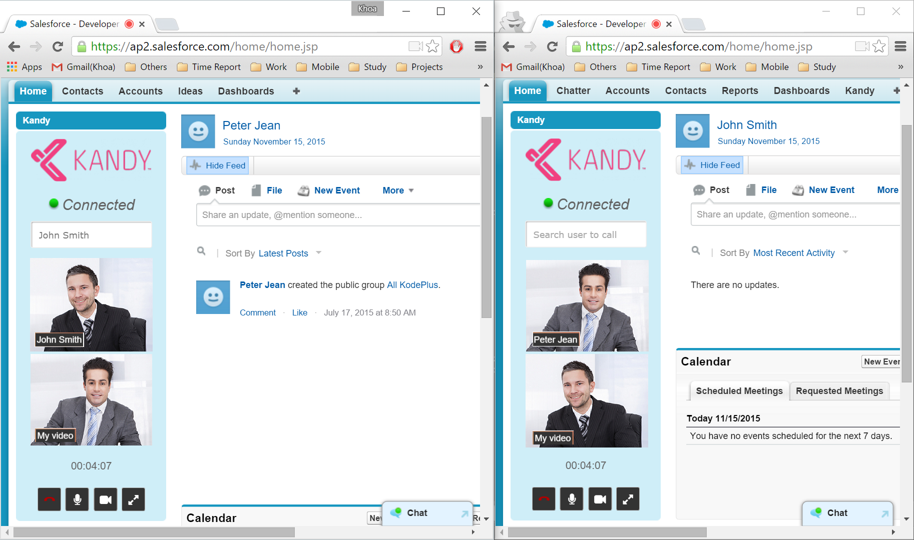

### Installation

Use this link <https://login.salesforce.com/packaging/installPackage.apexp?p0=04t28000000NAp5> to install Kandy package to your application.

##### Configure package

- **Assign home page layout**
  - From Setup, click `Customize | Home | Home Page Layouts`.
  - Click `Page Layout Assignment`.
  - Click `Edit Assignment`.
  - Choose the appropriate page layout: `Kandy Admin Layout` for System Admin profile and `Kandy Home Layout` for others.
  - Click Save.

- **Configure custom sidebar**
  - From Setup, click `Customize | User Interface`.
  - Check `Show Custom Sidebar Components on All Pages`.
  - Click Save.

- **Configure Kandy pages access permissions**
  - From Setup, click `Develop | Pages` click the `Security` link of `Kandy Address Book, Kandy Widget, Video Call Answer` pages and then add the profile you want to grant access permission.

- **Configure Kandy API**
  - From Setup, click `Security Controls | Remote Site Settings` . Click on `New Remote Site`.
  - Add link `https://api.kandy.io` to the `Remote Site Url` input, the `Remote Site Name` is whatever you want.
  - Click `Save`.
  - From the Kandy Links widget on sidebar, click `Kandy Setting` to configure Kandy Project API key, Project API secret and domain name. Please note that the project api key is different from account api key. Each project has an api key, which usually starts with DAK.

- **Assign Kandy user for each Salesforce user**
  - When the widget `Kandy Links | Kandy Assignment` loads for the first time, it assigns Kandy users to Salesforce users automatically. Going forward, an administrator can maintain these associations using this link `Kandy Assignment`.
  - When Administrator adds a new user through `Setup | Manage Users | Users | New User`, this user will be assigned automatically to a Kandy user. If all Kandy users are already assigned, a new Kandy user will be created.

- **Add PSTN, SMS, P2P Call to Contact page**
  - View a particular contact
  - Select `Edit Layout | Visualforce Pages`
  - Drag and drop `Kandy P2P Call` and `Kandy PSTN and SMS` to the Contact Information section below.
  - Change the default height 200px to 20px.

##### Usage

